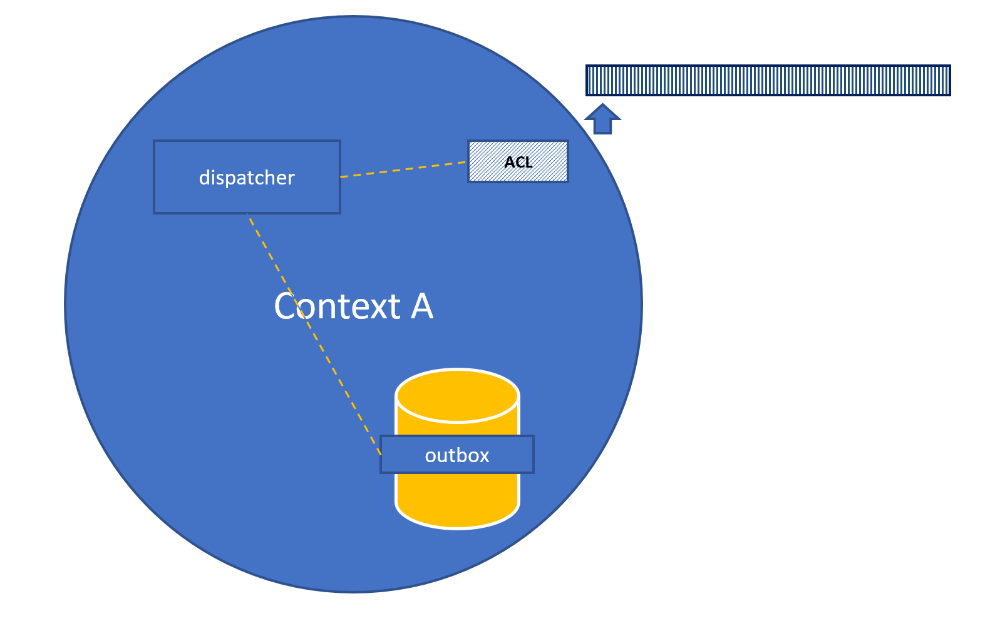

## Communication between contexts

When driving processes or passing information to build read models between contexts, what kind of events are we sending between services?
It easy to assume that if Context A is using events to drive it internal state, that we just publish these side efftect to the rest of the world. This might solve building a model for read or trigger some proccess in another context, but quickly gets to granular and volatile. Informing the rest of the world with a business realted events is often a better fit.

*Here we call side effects - domain events, and the public event(s) integration events.*

A change in context A is triggered and event(s) created. After writing them to a local stream (ES), they are put in an outbox, in the same transaction. A seperate single process process the outbox. The outbox then checks to see if there is something we want to share with the world, an integration event. If so it's published , if not it's move to the inbox. Both the outbox and inbox are persisted queues owned by the context. The inbox is then read to dipatch events within the context. If a change is of value to rest of the world, a domain event might be crated by some ACL then but in the outbox and dispatched out from the context.

Event going through the inbox might trigger an Integration Event to be published (image below).

The consuming context puts messages of interest in it's inbox, from there they will be dispached. On it's way it might be transformed by an ACL to fit the context. This depends on the kind of relationship between the contexts.

        
When using an EventStore, the outbox might not be needed, the disptacher could subscribe to changes or pull the "all" stream or equivilant. 

---

**Note** The example above does't imply usage of DTC. Just some for of implemention of the outbox pattern.

---

### Resources

* [Domain events vs event sourcing](https://www.innoq.com/en/blog/domain-events-versus-event-sourcing/)